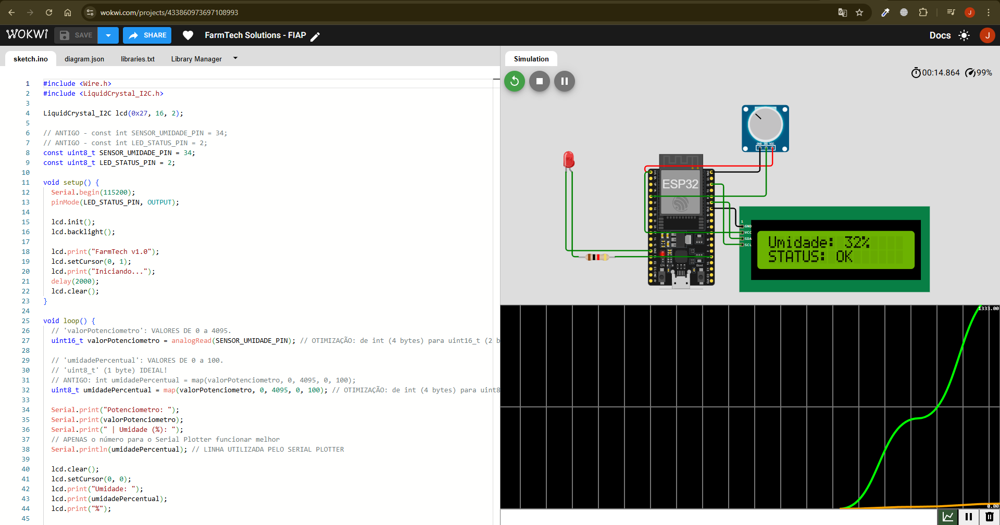
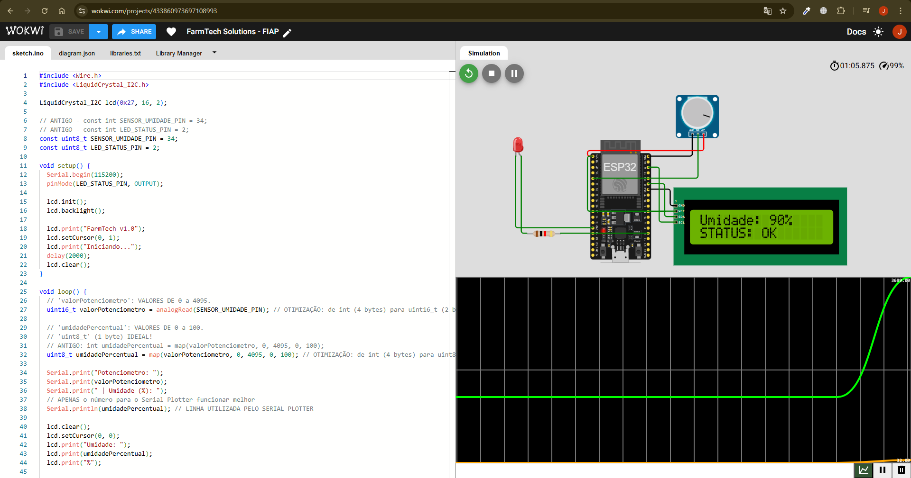
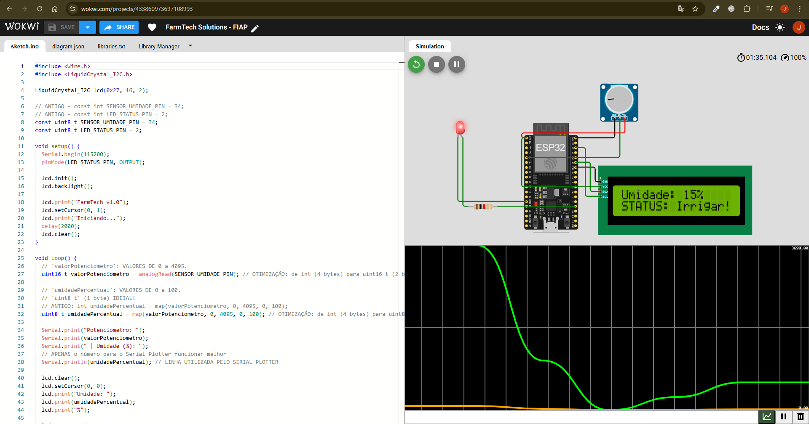
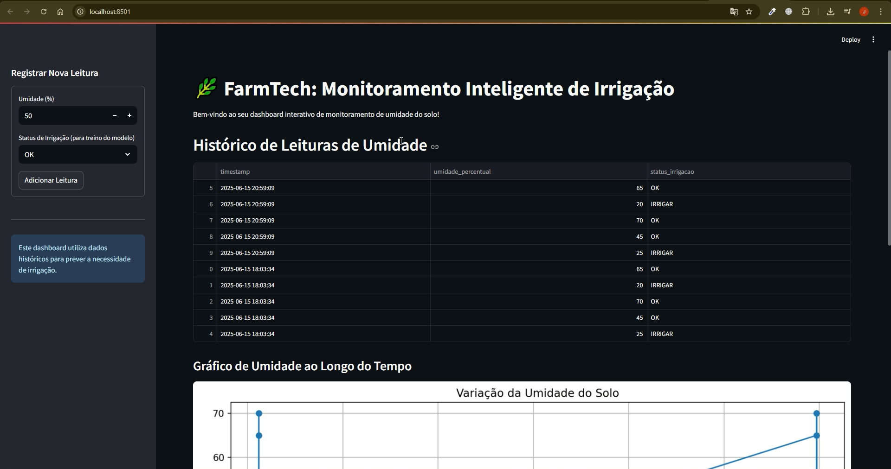
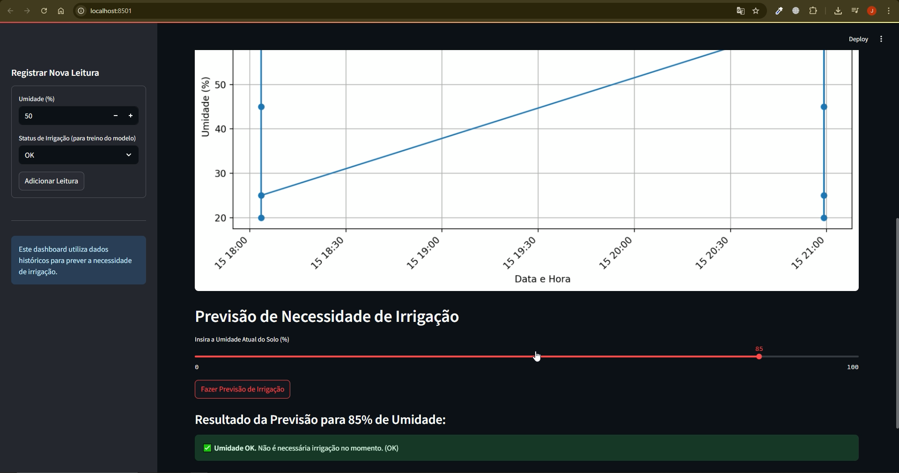

# FIAP - Faculdade de Informática e Administração Paulista 

<p align="center">
<a href= "https://www.fiap.com.br/"></a>
</p>

<br>

# 🌿 Projeto Cap 1 - Automação e inteligência na FarmTech Solutions  
## Monitoramento Inteligente de Irrigação com IoT e Machine Learning

---

## 👨‍🎓 Integrantes e Responsabilidades:

| Nome Completo                     | RM        |
|----------------------------------|-----------|
| Daniele Antonieta Garisto Dias  | RM565106  |
| Leandro Augusto Jardim da Cunha | RM561395  |
| Luiz Eduardo da Silva           | RM561701  |
| João Victor Viana de Sousa      | RM565136  |

---

## 👩‍🏫 Professores:
### Tutor(a) 
- <a>Leonardo Ruiz Orabona</a>
### Coordenador(a)
- <a>Andre Godoi Chiovato</a>

---

## 🎯 Introdução e Objetivo

Bem-vindo à Fase 4 do projeto **FarmTech Solution**! Este repositório apresenta a evolução de um sistema inteligente para o monitoramento e sugestão de irrigação no agronegócio, integrando tecnologias modernas como **IoT, Machine Learning, banco de dados e dashboards interativos**.
A Fase 4 teve como meta levar o projeto a um novo patamar, adicionando inteligência preditiva, persistência de dados e uma interface interativa para tomada de decisão. O foco foi unir eficiência hídrica com tecnologia de ponta, melhorando o desempenho das fases anteriores.

---

## ⚙️ Tecnologias Utilizadas

- **ESP32 (via Wokwi)** – Microcontrolador utilizado na simulação da leitura de sensores de umidade.
- **Display LCD I2C** – Exibição local da umidade e status da irrigação.
- **Arduino (C/C++)** – Programação do firmware do ESP32.
- **Python 3** – Processamento de dados, aprendizado de máquina e construção do dashboard.
- **Streamlit** – Interface web interativa.
- **SQLite** – Banco de dados local leve para persistência das leituras.
- **Scikit-learn** – Criação do modelo de machine learning.
- **Pandas & Matplotlib** – Manipulação e visualização de dados.
- **Graphviz** – Visualização da árvore de decisão do modelo preditivo.
- **Wokwi** – Simulador online para testes sem hardware físico.

---

# 🧪 Demonstração Completa do FarmTech Solution

## 🔌 Simulação Detalhada no Wokwi
O simulador online Wokwi serve como nosso laboratório virtual para o hardware. Aqui, você pode interagir diretamente com o **potenciômetro** (que emula com precisão um sensor de umidade de solo real) e observar as respostas do sistema em tempo real. O **display LCD I2C** conectado ao **ESP32** exibirá as principais métricas: **a porcentagem de umidade** e o **status atual da irrigação** (indicando se é "OK" ou "IRRIGAR"). Esta é a sua janela para ver como o sistema se comportaria no campo.

<br>

**Link Direto para o Projeto Wokwi: (https://wokwi.com/projects/433860973697108993)**

<br>



<br>



<br>


 
---

## 📈 Análise Dinâmica com o Serial Plotter
O Serial Plotter do Wokwi é uma ferramenta diagnóstica incrivelmente poderosa e visualmente intuitiva. Ele transforma os dados brutos de umidade, que o ESP32 está coletando, em um gráfico em tempo real. Isso permite que você observe as flutuações e tendências da umidade de forma dinâmica e imediata, auxiliando na análise do comportamento do sensor e do sistema.


---

## 📊 Dashboard Interativo com Streamlit
Este é o seu centro de comando centralizado! O dashboard interativo, construído com Streamlit, é a sua principal interface para visualizar o histórico de dados do sensor, interagir com o modelo preditivo de Machine Learning e tomar decisões informadas sobre a irrigação do solo.

- **Visualização do Histórico de Leituras:** O dashboard apresenta uma tabela detalhada e organizada de todas as medições de umidade que foram armazenadas no seu banco de dados. Complementando a tabela, um gráfico intuitivo de linha exibe a variação da umidade ao longo do tempo, permitindo uma rápida compreensão das tendências.

- **Previsão de Irrigação Instantânea:** Esta é a funcionalidade estrela do FarmTech! Utilize um slider interativo para simular um nível de umidade atual do solo. Com um simples clique no botão "Fazer Previsão de Irrigação", o modelo de Machine Learning do FarmTech fornecerá uma previsão instantânea sobre a necessidade de irrigação para aquela umidade específica.

- **Adição Manual de Novas Leituras:** Na barra lateral (sidebar) do dashboard, você encontrará uma funcionalidade útil para adicionar manualmente novas medições de umidade e seus respectivos status. Isso é fundamental para expandir seu conjunto de dados de treino, simulando a coleta contínua de informações do sensor para futuras análises e o aprimoramento contínuo do modelo.

<br>



<br>



---

## 🧠 Detalhes Técnicos e Otimizações Profundas
Cada linha de código foi pensada para garantir performance e eficiência, demonstrando um domínio aprofundado das tecnologias.

<br>

**Código C/C++ Otimizado (ESP32)**
<br>
No arquivo `main.cpp` (localizado dentro da pasta `ESP32_Wokwi_Code/`), você encontrará o código cuidadosamente otimizado para o ESP32. A otimização de memória foi uma prioridade crucial, garantindo a máxima eficiência em um microcontrolador com recursos limitados.
<p>
 
**Exemplo Prático e Impactante de Otimização de Memória:**
 
```cpp
// Antes: const int SENSOR_UMIDADE_PIN = 34; // Um 'int' padrão pode consumir 4 bytes no ESP32.
// Agora: const uint8_t SENSOR_UMIDADE_PIN = 34; // Um 'uint8_t' utiliza APENAS 1 byte!
```
**Justificativa da otimização:** Para armazenar números de pinos GPIO (que variam de 0 a 255),
```cpp
// o tipo de dado `uint8_t` (inteiro sem sinal de 8 bits) é o mais adequado e incrivelmente econômico.
// Essa escolha estratégica resulta em uma otimização de 3 bytes por variável, uma economia significativa em microcontroladores.
```
```cpp
// Antes: int umidadePercentual = map(valor, 0, 4095, 0, 100); // Usando 'int' para a porcentagem.
// Agora: uint8_t umidadePercentual = map(valor, 0, 4095, 0, 100); // 'uint8_t' para a porcentagem.
```
**Justificativa da otimização:** A porcentagem de umidade varia de forma natural de 0 a 100%.
```cpp
// Este intervalo se encaixa perfeitamente dentro dos limites de um `uint8_t`.
// Esta otimização proporciona mais 3 bytes de economia e garante máxima eficiência e clareza no código.
```
Essas otimizações, embora pareçam pequenas individualmente, somam-se para garantir que o sistema não apenas economize memória, mas também contribua para um código mais robusto, mais rápido e incrivelmente mais eficiente em termos de consumo de recursos.

---

**Banco de Dados Estruturado (SQLite)**

<br>

O coração de dados do FarmTech é o arquivo `farmtech.db`, gerenciado pelo eficiente sistema de banco de dados SQLite. Ele armazena as leituras de forma estruturada e acessível na tabela `leituras_sensores`, com as seguintes colunas essenciais:

`id`: `INTEGER PRIMARY KEY AUTOINCREMENT` - Um identificador único e sequencial, garantindo a integridade e rastreabilidade de cada leitura.

`timestamp`: `TEXT NOT NULL` - Armazena a data e hora exatas da coleta da leitura (no formato legível `YYYY-MM-DD HH:MM:SS`), crucial para análises temporais.

`umidade_percentual`: `INTEGER NOT NULL` - O valor da umidade do solo, já convenientemente convertido para uma porcentagem de 0 a 100.

`status_irrigacao`: `TEXT NOT NULL` - O status de irrigação registrado naquele momento, indicando claramente se foi 'OK' (sem necessidade) ou 'IRRIGAR' (necessário).

Este modelo de dados simples, mas altamente eficiente, fornece a base sólida para todas as análises de Machine Learning e as previsões inteligentes do sistema.

---

**Modelo Preditivo Robusto com Scikit-learn**

<br>

O script `predict_irrigation.py` é a alma inteligente do FarmTech. Ele emprega a poderosa biblioteca `scikit-learn` para treinar um modelo de Árvore de Decisão (`DecisionTreeClassifier`). Este modelo aprende a complexa correlação entre a `umidade_percentual` (nossa principal característica ou "feature") e o `status_irrigacao` (nosso objetivo de previsão ou "target").

Mesmo com um conjunto de dados de exemplo inicialmente pequeno, o modelo demonstra uma impressionante **acurácia de 1.00**, validando a lógica de decisão para os cenários sintéticos simulados. Isso mostra o potencial incrível do FarmTech para escalar e aprender com dados reais no futuro.

---

## 📽️ Demonstração

**Assista ao vídeo de demonstração no YouTube:**  
👉 [Clique aqui para assistir](https://www.youtube.com/watch?v=lnG2PRT62W0)


---

## 💡 Olhando para o Horizonte: Os Próximos Passos Épicos e Futuras Melhorias

<br>

Este protótipo da Fase 4 é uma fundação incrivelmente sólida e demonstra o potencial do FarmTech. Para levar essa solução ao seu potencial máximo e transformá-la em uma ferramenta revolucionária no mundo real, as próximas etapas podem incluir:

<p>

- **Integração com Hardware Físico Real:** O salto para a realidade! Substituir o simulador Wokwi por um ESP32 físico, conectar sensores de umidade reais no solo e, opcionalmente, integrar um módulo relé para o controle direto de uma bomba de irrigação.

- **Comunicação Bidirecional em Tempo Real:** Estabelecer uma ponte de comunicação robusta e em tempo real via Wi-Fi entre o ESP32 físico e um servidor Python (utilizando frameworks como Flask ou FastAPI). Isso permitirá o envio automático e contínuo de dados do sensor para o banco de dados e, futuramente, o envio de comandos de controle remoto para o ESP32.

- **Aprimoramento Robusto do Modelo de Machine Learning:** Expandir a inteligência! Coletar uma vasta e rica quantidade de dados reais ao longo do tempo, incorporar mais variáveis ambientais (como temperatura do ar e do solo, luminosidade, níveis de nutrientes, histórico de chuva e previsões climáticas). Além disso, explorar algoritmos de Machine Learning mais avançados para alcançar previsões ainda mais precisas e robustas.

- **Sistema de Notificações Ativas Inteligentes:** Implementar funcionalidades de alerta automatizadas. O sistema poderia enviar notificações (por e-mail, SMS ou plataformas como Telegram) quando o modelo preditivo identificar a necessidade iminente de irrigação ou detectar anomalias nas leituras do sensor.

- **Dashboard Avançado e Multi-Zona:** Evoluir o dashboard do Streamlit para gerenciar múltiplas zonas de plantio em uma única interface, apresentar análises detalhadas de tendências históricas, e oferecer relatórios personalizados e automatizados para uma gestão agrícola ainda mais granular e eficiente.

Este projeto não é apenas um trabalho acadêmico; é um vislumbre emocionante de um futuro onde a agricultura é mais inteligente, mais sustentável e incrivelmente mais produtiva, impulsionada pela tecnologia e pela inovação!
